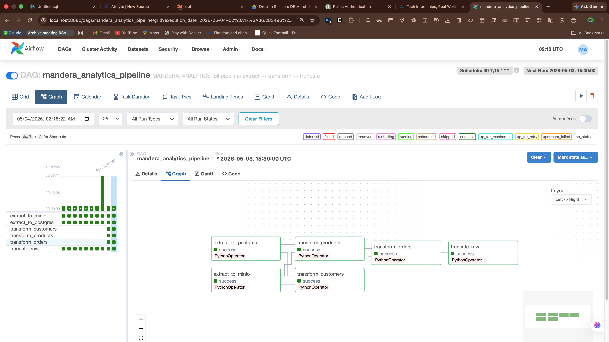
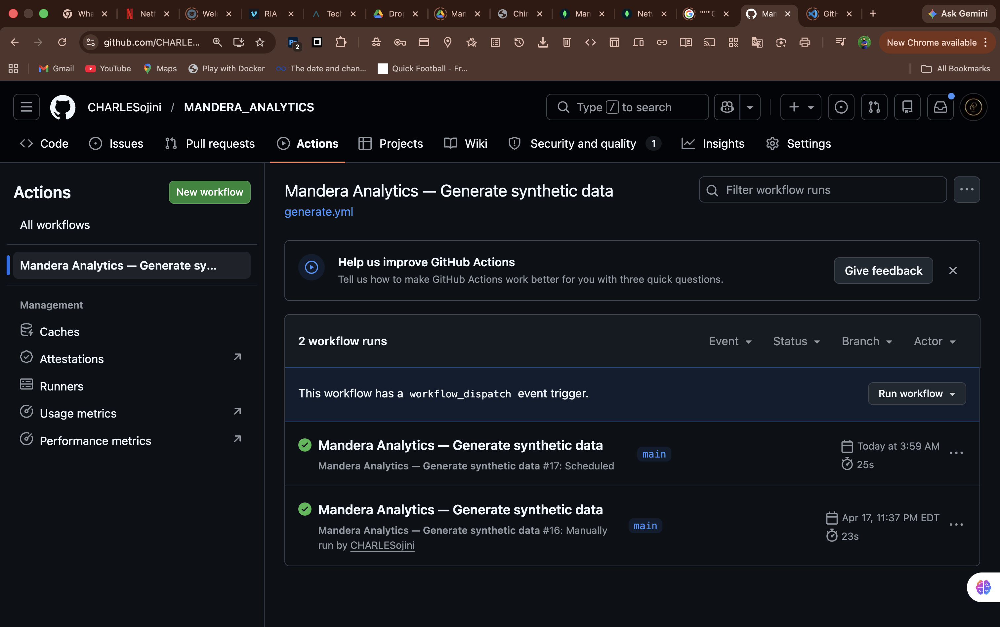
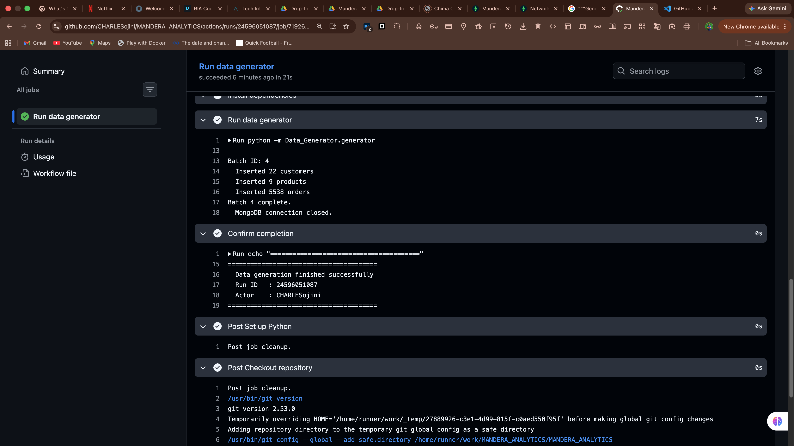
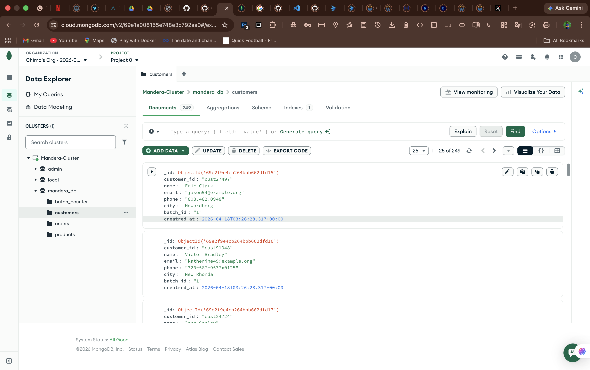
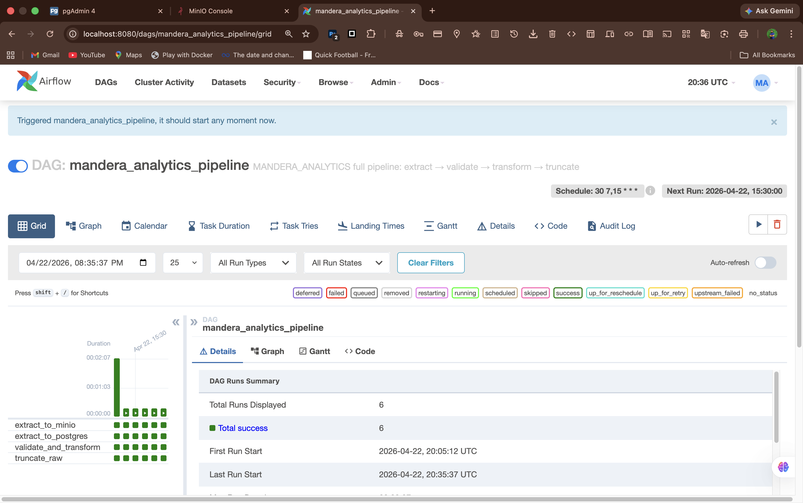
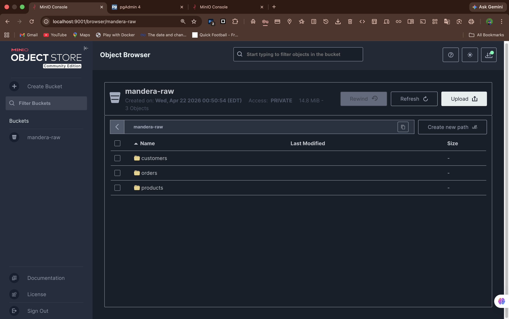
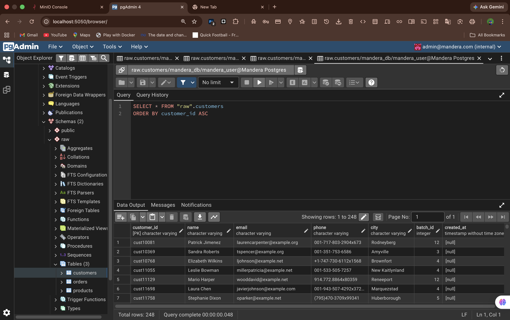
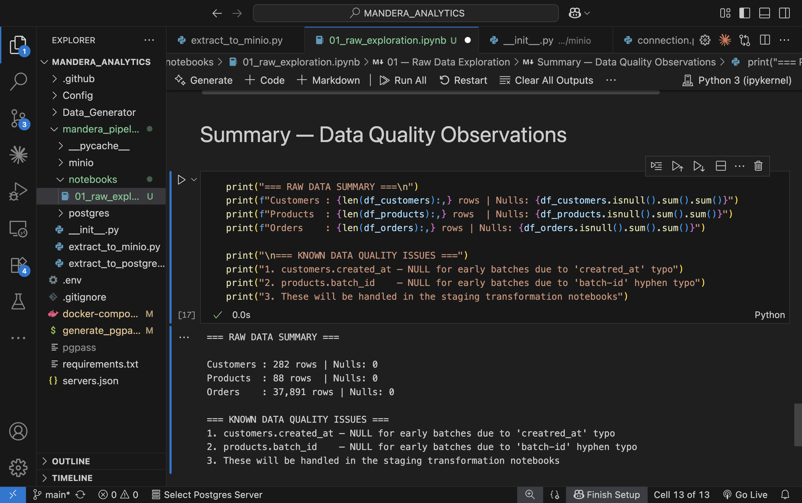

# MANDERA_ANALYTICS

An end-to-end batch data pipeline that generates synthetic e-commerce data, archives it to object storage, loads it into a relational database, validates and cleans it through a staging layer, and orchestrates the full flow with Apache Airflow — all running locally via Docker Compose.

---

## Table of Contents

- [Project Overview](#project-overview)
- [Architecture](#architecture)
- [Tech Stack](#tech-stack)
- [Directory Structure](#directory-structure)
- [Prerequisites](#prerequisites)
- [Setup](#setup)
- [Running the Project](#running-the-project)
- [Running the Data Generator](#running-the-data-generator)
- [DAG Task Dependency Graph](#dag-task-dependency-graph)
- [Pipeline in Action](#pipeline-in-action)
- [Environment Variables](#environment-variables)
- [Service URLs](#service-urls)
- [Contributing](#contributing)

---

## Project Overview

MANDERA_ANALYTICS simulates a real-world retail data pipeline for the Mandera region. Every 12 hours, a GitHub Actions workflow generates synthetic orders, customers, and products and inserts them into MongoDB Atlas. Thirty minutes later, an Airflow DAG picks up the data and:

1. Archives raw MongoDB documents to MinIO as dated JSON files (durable raw layer)
2. Loads those same documents into PostgreSQL's `raw` schema
3. Validates and cleans each entity in parallel, loading results into the `staging` schema
4. Truncates the raw tables once staging is successfully loaded (raw data is safely preserved in MinIO)

The staging schema enforces referential integrity and data quality rules, making it ready for downstream analytics, BI dashboards, or a data warehouse.

---

## Architecture

```
┌─────────────────────────────────────────────────────────────────────┐
│                    MANDERA_ANALYTICS PIPELINE                        │
└─────────────────────────────────────────────────────────────────────┘

  ┌─────────────────────────────────┐
  │   GitHub Actions (8 AM / 4 PM WAT)   │
  │   python -m Data_Generator.generator │
  └────────────────┬────────────────┘
                   │ inserts batch
                   ▼
         ┌──────────────────┐
         │   MongoDB Atlas   │  (customers, products, orders collections)
         └────────┬─────────┘
                  │ 30 min later — Airflow DAG triggers
                  ▼
  ┌───────────────────────────────────────────────┐
  │              Apache Airflow DAG               │
  │                                               │
  │  extract_to_minio ──┐                         │
  │                     ├──► transform_customers──┐│
  │  extract_to_postgres┤                         ││
  │                     └──► transform_products ──┼┤──► transform_orders ──► truncate_raw
  │                                               ││
  └───────────────────────────────────────────────┘│
                                                   │
          ┌────────────────────┬──────────────────-┘
          ▼                    ▼
  ┌──────────────┐    ┌──────────────────────┐
  │    MinIO      │    │  PostgreSQL           │
  │  (raw JSON    │    │                       │
  │   archive)    │    │  raw.customers        │
  │               │    │  raw.products         │
  │ customers/    │    │  raw.orders           │
  │ products/     │    │       │               │
  │ orders/       │    │       ▼ (transform)   │
  │  YYYY-MM-DD/  │    │  staging.customers    │
  │  batch_N.json │    │  staging.products     │
  └──────────────┘    │  staging.orders       │
                       └──────────────────────┘
```

**Data flow in plain English:**

| Step | What happens |
|------|-------------|
| Generation | Faker produces 15–25 customers, 5–10 products, and 3,000–6,500 orders per batch |
| Archive | Raw MongoDB documents are serialised to JSON and uploaded to MinIO with a dated path |
| Extract | The same documents are bulk-inserted into PostgreSQL `raw.*` tables with no transformation |
| Transform | Each entity is independently validated and cleaned into `staging.*` with FK constraints |
| Truncate | `raw.*` tables are cleared after every successful staging load |

---

## Tech Stack

| Component | Technology |
|-----------|-----------|
| Orchestration | Apache Airflow 2.8 (LocalExecutor) |
| Data source | MongoDB Atlas |
| Object storage | MinIO |
| Relational database | PostgreSQL 15 |
| Data generation | Python + Faker |
| Containerisation | Docker Compose |
| Notebooks | JupyterLab (PySpark kernel) |
| Database UI | pgAdmin 4 |
| CI / data generation | GitHub Actions |
| Language | Python 3.9+ |

---

## Directory Structure

```
MANDERA_ANALYTICS/
│
├── Config/                          # Centralised settings
│   ├── __init__.py
│   └── settings.py                  # MongoDB URL, collection names, batch size ranges,
│                                    # product categories, and batch_id generator
│
├── Data_Generator/                  # Synthetic data generation
│   ├── generator.py                 # Orchestrator — calls all three fake_* modules
│   ├── fake_customers.py            # Generates 15–25 customer records per run
│   ├── fake_products.py             # Generates 5–10 product records per run
│   └── fake_orders.py               # Generates 3,000–6,500 order records per run
│
├── mandera_pipeline/                # Core ETL pipeline
│   ├── extract_to_minio.py          # Entry point: MongoDB → MinIO JSON archive
│   ├── extract_to_postgres.py       # Entry point: MongoDB → PostgreSQL raw schema
│   │
│   ├── dags/
│   │   └── mandera_dag.py           # Airflow DAG definition
│   │
│   ├── postgres/                    # PostgreSQL connection and extraction helpers
│   │   ├── connection.py            # get_pg_connection(), get_mongo_client()
│   │   ├── schema.py                # Creates raw and staging schemas
│   │   ├── extract_customers.py
│   │   ├── extract_products.py
│   │   └── extract_orders.py
│   │
│   ├── minio/                       # MinIO connection and upload helpers
│   │   ├── connection.py            # get_minio_client()
│   │   ├── bucket.py                # ensure_bucket_exists()
│   │   ├── upload_customers.py
│   │   ├── upload_products.py
│   │   └── upload_orders.py
│   │
│   ├── transform/                   # Validation and staging load (raw → staging)
│   │   ├── db_utils.py              # Shared: connection, schema creation, raw fetch
│   │   ├── transform_customers.py
│   │   ├── transform_products.py
│   │   └── transform_orders.py
│   │
│   └── notebooks/                   # Jupyter exploration and prototyping
│       ├── 01_raw_exploration.ipynb
│       ├── customers_transform.ipynb
│       ├── products_transform.ipynb
│       ├── orders_transform_pyspark.ipynb
│       └── load_staging.ipynb
│
├── .github/
│   └── workflows/
│       └── generate.yml             # Runs Data_Generator at 8 AM and 4 PM WAT daily
│
├── docker-compose.yml               # Full local stack (8 services)
├── init_db.sql                      # Creates airflow_db on first container start
├── requirements.txt                 # Data generator dependencies
├── airflow-requirements.txt         # Airflow container dependencies
├── generate_pgpass.sh               # Generates pgpass file for pgAdmin auto-login
└── .env                             # Credentials and config (not committed)
```

---

## Prerequisites

- **Docker Desktop** (or Docker Engine + Compose plugin) — v24+
- **Python 3.9+** — only needed if you want to run scripts outside Docker
- **MongoDB Atlas account** — a free M0 cluster is sufficient
- A `.env` file with valid credentials (see [Environment Variables](#environment-variables))

---

## Setup

### 1. Clone the repository

```bash
git clone https://github.com/CHARLESojini/MANDERA_ANALYTICS.git
cd MANDERA_ANALYTICS
```

### 2. Create your `.env` file

Copy the template below and fill in your own values:

```bash
# MongoDB Atlas
MONGO_URL=mongodb+srv://<user>:<password>@<cluster>.mongodb.net/<dbname>?appName=<App>
MONGO_DB_NAME=mandera_db

# PostgreSQL (Docker)
POSTGRES_HOST=postgres
POSTGRES_PORT=5432
POSTGRES_DB=mandera_db
POSTGRES_USER=mandera_user
POSTGRES_PASSWORD=mandera_pass

# MinIO (Docker)
MINIO_ENDPOINT=minio:9000
MINIO_ACCESS_KEY=mandera_minio_user
MINIO_SECRET_KEY=mandera_minio_pass
MINIO_BUCKET=mandera-raw

# pgAdmin
PGADMIN_EMAIL=admin@mandera.com
PGADMIN_PASSWORD=mandera_pass

# Airflow
AIRFLOW_USER=admin
AIRFLOW_PASSWORD=mandera_admin
AIRFLOW_EMAIL=admin@mandera.com

# Jupyter
JUPYTER_TOKEN=mandera_jupyter_token
```

> **Note:** When connecting from your host machine (e.g. running scripts locally), set `POSTGRES_HOST=localhost` and `POSTGRES_PORT=5438`. Inside Docker containers, use `POSTGRES_HOST=postgres` and `POSTGRES_PORT=5432`.

### 3. Generate pgAdmin credentials file

```bash
chmod +x generate_pgpass.sh && ./generate_pgpass.sh
```

### 4. Start all services

```bash
docker compose up -d
```

The first run will:
- Pull all Docker images (~2–3 minutes)
- Run `airflow db init` and create the admin user (`airflow-init` container)
- Create the `airflow_db` database (`db-init` container)
- Install pipeline dependencies inside the Airflow containers

Check that everything is healthy:

```bash
docker compose ps
```

All services should show `healthy` or `running` within about 60–90 seconds.

---

## Running the Project

### Trigger the DAG manually

1. Open the Airflow UI at `http://localhost:8080` (credentials: `admin` / `mandera_admin`)
2. Find the **`mandera_analytics_pipeline`** DAG
3. Toggle it **On** if it is paused
4. Click **Trigger DAG** → the run will start immediately

The scheduled runs fire automatically at **8:30 AM WAT** and **4:30 PM WAT** every day, 30 minutes after GitHub Actions injects fresh data.

### Run individual pipeline steps manually (outside Docker)

```bash
# Install dependencies
pip install -r requirements.txt -r airflow-requirements.txt

# Extract MongoDB → MinIO
python -m mandera_pipeline.extract_to_minio

# Extract MongoDB → PostgreSQL raw schema
python -m mandera_pipeline.extract_to_postgres

# Transform each entity into the staging schema
python -m mandera_pipeline.transform.transform_customers
python -m mandera_pipeline.transform.transform_products
python -m mandera_pipeline.transform.transform_orders
```

### Stop the stack

```bash
docker compose down          # Stop containers, keep volumes
docker compose down -v       # Stop containers and wipe all volumes
```

---

## Running the Data Generator

The data generator inserts a new batch of synthetic records into MongoDB Atlas. GitHub Actions runs it automatically, but you can also trigger it manually.

```bash
# Install dependencies (first time only)
pip install -r requirements.txt

# Run the generator
python -m Data_Generator.generator
```

Each run produces:
- **15–25** customer records
- **5–10** product records
- **3,000–6,500** order records

All records are tagged with a sequential `batch_id` (auto-incremented in MongoDB) and a `created_at` timestamp.

### GitHub Actions schedule

The workflow at `.github/workflows/generate.yml` runs the generator on a cron:

| Time (WAT) | Time (UTC) | Trigger |
|-----------|-----------|---------|
| 8:00 AM | 07:00 UTC | Automated |
| 4:00 PM | 15:00 UTC | Automated |

You can also trigger it manually from the **Actions** tab on GitHub with an optional `reason` input.

---

## DAG Task Dependency Graph

```
  extract_to_minio    ──┐
                        ├──► transform_customers ──┐
  extract_to_postgres ──┤                          ├──► transform_orders ──► truncate_raw
                        └──► transform_products ───┘
```

| Task | Depends on | Description |
|------|-----------|-------------|
| `extract_to_minio` | — | Archives MongoDB documents to MinIO as dated JSON |
| `extract_to_postgres` | — | Bulk-inserts MongoDB documents into `raw.*` tables |
| `transform_customers` | Both extracts | Validates and loads clean records into `staging.customers` |
| `transform_products` | Both extracts | Validates and loads clean records into `staging.products` |
| `transform_orders` | Both transforms | Validates and loads clean records into `staging.orders` (FK constraints require customers and products to exist first) |
| `truncate_raw` | `transform_orders` | Clears `raw.*` tables; raw data is durably archived in MinIO |

**DAG settings:**
- Schedule: `30 7,15 * * *` (07:30 and 15:30 UTC daily)
- Catchup: disabled
- Max active runs: 1 (prevents overlapping pipeline runs)
- Retries: 2 attempts per task, 5-minute delay between retries

**Airflow graph view** — parallel per-entity transforms with all tasks succeeding:



---

## Pipeline in Action

Screenshots of the live system across every layer of the pipeline.

### Data Generation — GitHub Actions

The workflow runs automatically twice a day and inserts a fresh batch into MongoDB Atlas. Each run prints a summary of records inserted.





### Source — MongoDB Atlas

Raw documents land in the `mandera_db` database across three collections. Every record carries a `batch_id` for lineage tracking.



### Orchestration — Apache Airflow

The DAG runs summary shows all pipeline runs, their duration, and schedule status at a glance.



### Object Storage — MinIO

Raw MongoDB documents are archived as dated JSON files in the `mandera-raw` bucket before any transformation occurs.



### Relational Database — pgAdmin

After extraction, raw records are available in PostgreSQL's `raw` schema and ready for the transform step.



### Data Quality — Jupyter Notebook

The exploration notebook profiles the raw schema, documents known data quality issues, and forms the basis for the transform rules applied in staging.



---

## Environment Variables

| Variable | Used by | Description |
|----------|---------|-------------|
| `MONGO_URL` | Generator, extract | MongoDB Atlas connection string |
| `MONGO_DB_NAME` | Generator, extract | MongoDB database name |
| `POSTGRES_HOST` | Extract, transform | PostgreSQL hostname |
| `POSTGRES_PORT` | Extract, transform | PostgreSQL port (`5432` inside Docker, `5438` from host) |
| `POSTGRES_DB` | Extract, transform | PostgreSQL database name |
| `POSTGRES_USER` | Extract, transform | PostgreSQL username |
| `POSTGRES_PASSWORD` | Extract, transform | PostgreSQL password |
| `MINIO_ENDPOINT` | MinIO upload | MinIO API endpoint (`minio:9000` inside Docker) |
| `MINIO_ACCESS_KEY` | MinIO upload | MinIO access key |
| `MINIO_SECRET_KEY` | MinIO upload | MinIO secret key |
| `MINIO_BUCKET` | MinIO upload | Target bucket name |
| `PGADMIN_EMAIL` | pgAdmin | pgAdmin login email |
| `PGADMIN_PASSWORD` | pgAdmin | pgAdmin login password |
| `AIRFLOW_USER` | Airflow init | Airflow admin username |
| `AIRFLOW_PASSWORD` | Airflow init | Airflow admin password |
| `AIRFLOW_EMAIL` | Airflow init | Airflow admin email |
| `JUPYTER_TOKEN` | Jupyter | Fixed token for JupyterLab access |

---

## Service URLs

| Service | URL | Default credentials |
|---------|-----|-------------------|
| Airflow UI | http://localhost:8080 | `admin` / `mandera_admin` |
| JupyterLab | http://localhost:8888 | token: `mandera_jupyter_token` |
| pgAdmin | http://localhost:5050 | `admin@mandera.com` / `mandera_pass` |
| MinIO Console | http://localhost:9001 | `mandera_minio_user` / `mandera_minio_pass` |
| MinIO API | http://localhost:9000 | — |
| PostgreSQL | localhost:5438 | `mandera_user` / `mandera_pass` |

---

## Contributing

1. Fork the repository and create a feature branch from `main`:
   ```bash
   git checkout -b feat/your-feature-name
   ```

2. Make your changes. Keep each commit focused on a single concern.

3. Follow the existing naming conventions:
   - Branch names: `feat/`, `fix/`, `docs/`, `refactor/` prefixes
   - Commit messages: [Conventional Commits](https://www.conventionalcommits.org/) style (`feat:`, `fix:`, `docs:`, etc.)
   - Python modules: one module per entity, one responsibility per module

4. Test your changes locally before opening a PR:
   ```bash
   docker compose up -d
   # trigger the DAG manually and verify all tasks pass
   ```

5. Push your branch and open a Pull Request against `main` with a clear title and description explaining what changed and why.

6. Keep PRs small and reviewable. Large refactors should be discussed in an issue first.
